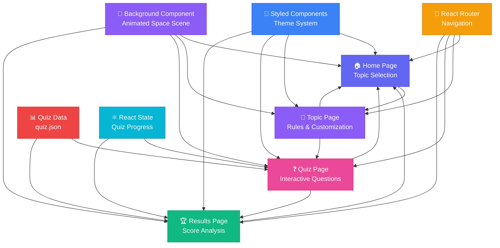

# 🚀 TrendTrivia - Stay Current, Stay Smart!

<div align="center">


**A modern, interactive trivia application that tests your knowledge on the latest trends across Technology, Pop Culture, Finance, and Start-ups.**

[](https://reactjs.org/)
[](https://vitejs.dev/)
[](https://styled-components.com/)
[](https://threejs.org/)

[🎮 Live Demo](#) | [📖 Documentation](#installation) | [🐛 Report Bug](../../issues) | [✨ Request Feature](../../issues)

</div>

---

## 📋 Table of Contents

- [✨ Features](#-features)
- [🎮 App Flow & Screenshots](#-app-flow--screenshots)
- [🏗️ Tech Stack](#️-tech-stack)
- [📁 Project Architecture](#-project-architecture)
- [🚀 Installation & Setup](#-installation--setup)
- [🎯 Usage Guide](#-usage-guide)
- [🔧 Development](#-development)
- [📊 Quiz Data Structure](#-quiz-data-structure)
- [🎨 Design System](#-design-system)
- [🌟 Key Features Deep Dive](#-key-features-deep-dive)
- [🤝 Contributing](#-contributing)
- [📄 License](#-license)

---

## ✨ Features

### 🎯 **Core Functionality**
- **4 Dynamic Categories**: Technology, Pop Culture, Finance, Start-ups
- **40 Latest Questions**: 10 curated, up-to-date questions per category
- **Smart Scoring System**: Performance tracking with detailed breakdown
- **Responsive Design**: Seamless experience across all devices
- **Immersive UI**: Space-themed animated background with parallax effects

### 🎮 **User Experience**
- **Intuitive Flow**: Home → Topic Selection → Quiz → Results
- **Progress Tracking**: Real-time question counter and progress bar
- **Duration Selection**: Customize quiz timeframe (Last Week/Month/Year)
- **Performance Analytics**: Detailed score breakdown and improvement suggestions
- **Smooth Animations**: Engaging transitions and micro-interactions

### 🎨 **Visual Excellence**
- **Modern Glass Morphism**: Contemporary UI with frosted glass effects
- **Animated Space Background**: Dynamic nebula gradients and shooting stars
- **Consistent Theme**: Cohesive color palette and typography
- **Accessibility First**: High contrast ratios and screen reader support

---

## 🎮 App Flow & Screenshots

### 🏠 **1. Home Screen**
*Welcome page with topic selection and motivational elements*


**Key Elements:**
- Welcome message with Socrates quote
- 4 interactive topic cards with emojis
- High score display
- Modern glass morphism design

---

### 🎯 **2. Topic Page**
*Rules explanation and quiz customization*


**Key Elements:**
- Dynamic topic title based on selection
- Clear game rules explanation
- Duration selection (Last Week/Month/Year)
- Start quiz button with hover effects

---

### ❓ **3. Quiz Page**
*Interactive question interface with progress tracking*


**Key Elements:**
- Question counter (e.g., "Question 3 of 10")
- Progress bar with smooth animations
- Multiple choice options with hover states
- Next/Submit button functionality

---

### 🏆 **4. Results Page**
*Comprehensive score breakdown and performance analysis*


**Key Elements:**
- Final score with percentage
- Performance breakdown by difficulty
- Motivational messages based on score
- Play again and home navigation options

---

## 🏗️ Tech Stack

### **Frontend Framework**
```
⚛️  React 18.2.0        - Modern component-based UI library
🏃  Vite 5.1.6          - Lightning-fast build tool and dev server
🎨  Styled Components   - CSS-in-JS styling solution
📱  React Router DOM    - Client-side routing and navigation
```

### **3D Graphics & Animation**
```
🌌  Three.js 0.162.0    - 3D graphics library for space background
🎭  React Three Fiber   - React renderer for Three.js
🎪  React Three Drei    - Useful helpers for React Three Fiber
```

### **Development Tools**
```
🔧  ESLint             - Code linting and formatting
🧪  Jest               - Unit testing framework
📦  npm                - Package management
🔨  Babel              - JavaScript transpilation
```

### **Deployment & Build**
```
⚡  Vite Build         - Optimized production builds
📦  Bundle Analysis    - Code splitting and optimization
🌐  Static Hosting     - Ready for Netlify, Vercel, GitHub Pages
```

---

## 📁 Project Architecture

### **Application Flow Diagram**



### **Component Hierarchy**

```mermaid
graph TD
    A["⚛️ App.jsx<br/>Main Application"] --> B["📱 React Router<br/>Route Management"]
    A --> C["🎨 ThemeProvider<br/>Global Styling"]
    A --> D["🌌 Background<br/>Animated Canvas"]
    
    B --> E["🏠 HomePage<br/>Topic Selection"]
    B --> F["🎯 TopicPage<br/>Rules & Setup"]
    B --> G["❓ QuizPage<br/>Question Interface"]
    B --> H["🏆 ScorePage<br/>Results Display"]
    
    C --> I["🎨 GlobalStyles<br/>CSS Reset"]
    C --> J["🎨 Theme<br/>Design Tokens"]
    
    E --> K["📝 Topic Cards<br/>Interactive Buttons"]
    E --> L["💯 High Score<br/>Display Component"]
    E --> M["💬 Quote<br/>Motivational Text"]
    
    F --> N["📋 Rules Section<br/>Game Instructions"]
    F --> O["⏱️ Duration Selector<br/>Time Period Choice"]
    F --> P["▶️ Start Button<br/>Quiz Launcher"]
    
    G --> Q["📊 Progress Bar<br/>Completion Status"]
    G --> R["❓ Question Card<br/>Content Display"]
    G --> S["🔘 Option Buttons<br/>Answer Choices"]
    G --> T["➡️ Navigation<br/>Next/Submit"]
    
    H --> U["🎯 Score Display<br/>Final Results"]
    H --> V["📈 Performance<br/>Breakdown Chart"]
    H --> W["🎉 Celebration<br/>Achievement Message"]
    H --> X["🔄 Action Buttons<br/>Play Again/Home"]
    
    style A fill:#6366f1,stroke:#4f46e5,color:#fff
    style B fill:#8b5cf6,stroke:#7c3aed,color:#fff
    style C fill:#3b82f6,stroke:#2563eb,color:#fff
    style D fill:#8b5cf6,stroke:#7c3aed,color:#fff
    style E fill:#10b981,stroke:#059669,color:#fff
    style F fill:#f59e0b,stroke:#d97706,color:#fff
    style G fill:#ec4899,stroke:#db2777,color:#fff
    style H fill:#06b6d4,stroke:#0891b2,color:#fff
```



### **Directory Structure**

```
TrendTrivia/
├── 📁 public/
│   └── quiz.json              # Quiz questions database (40 questions)
├── 📁 src/
│   ├── 📄 App.jsx            # Main application component with routing
│   ├── 📄 main.jsx           # Application entry point
│   ├── 📁 components/
│   │   ├── 📁 Background/
│   │   │   └── index.jsx     # Animated space background component
│   │   └── 📁 QuizCard/
│   │       └── index.jsx     # Reusable quiz card component
│   ├── 📁 pages/
│   │   ├── HomePage.jsx      # Landing page with topic selection
│   │   ├── TopicPage.jsx     # Quiz rules and customization
│   │   ├── QuizPage.jsx      # Interactive quiz interface
│   │   └── ScorePage.jsx     # Results and performance breakdown
│   ├── 📁 styles/
│   │   ├── globalStyles.js   # Global CSS reset and base styles
│   │   └── theme.js          # Design system tokens and variables
│   ├── 📁 hooks/             # Custom React hooks (future expansion)
│   └── 📁 utils/             # Utility functions and helpers
├── 📁 documents/             # Design mockups and wireframes
├── 📁 memory-bank/           # Project documentation and planning
├── 📁 screenshots/           # App screenshots for README
├── 📄 package.json          # Dependencies and scripts
├── 📄 vite.config.js        # Vite configuration
└── 📄 README.md             # This comprehensive guide
```

---

## 🚀 Installation & Setup

### **Prerequisites**
```bash
Node.js >= 16.0.0
npm >= 8.0.0
Git
```

### **Quick Start**
```bash
# 1. Clone the repository
git clone https://github.com/rahulgupta-nitjsr/trendtrivia.git
cd trendtrivia

# 2. Install dependencies
npm install

# 3. Start development server
npm run dev

# 4. Open your browser
# Navigate to http://localhost:5173
```

### **Build for Production**
```bash
# Create optimized production build
npm run build

# Preview production build locally
npm run preview
```

### **Development Scripts**
```bash
npm run dev      # Start development server with hot reload
npm run build    # Create production build
npm run preview  # Preview production build
npm run lint     # Run ESLint for code quality
npm run test     # Run Jest unit tests
```

---

## 🎯 Usage Guide

### **Playing the Quiz**

1. **🏠 Start at Home**: Choose from 4 trending categories
2. **🎯 Customize Experience**: Select duration and review rules
3. **❓ Answer Questions**: Progress through 10 curated questions
4. **🏆 View Results**: Analyze performance and celebrate achievements

### **Navigation Flow**
```
Home Screen → Topic Page → Quiz Page → Results Page
     ↑                                       ↓
     ←←←←←←←← Back to Home ←←←←←←←←←←←←←←←←←
```

### **Scoring System**
- **Easy Questions**: 1 point each
- **Medium Questions**: 2 points each  
- **Hard Questions**: 3 points each
- **Maximum Score**: 30 points per category
- **Performance Ratings**: 
  - 🏆 Excellent (90-100%)
  - 🌟 Great (70-89%)
  - 👍 Good (50-69%)
  - 📚 Keep Learning (<50%)

---

## 📊 Quiz Data Structure

### **Question Format**
```json
{
  "id": 1,
  "question": "Which company released a quantum chip in 2024?",
  "options": ["IBM", "Google", "Intel", "Apple"],
  "answer": "Google",
  "difficulty": "Hard",
  "category": "Technology"
}
```

### **Categories & Distribution**
```
📱 Technology (10 questions)
🎬 Pop Culture (10 questions)  
💰 Finance (10 questions)
🚀 Start-ups (10 questions)
```

### **Difficulty Levels**
- **Easy**: 30% of questions (Basic knowledge)
- **Medium**: 50% of questions (Current awareness)
- **Hard**: 20% of questions (Expert level)

---

## 🎨 Design System

### **Color Palette**
```css
Primary Colors:
- Background: #0a0a0a (Deep space black)
- Primary: #6366f1 (Cosmic purple)
- Secondary: #8b5cf6 (Nebula violet)

Text Colors:
- Primary Text: #ffffff (Pure white)
- Secondary Text: #a1a1aa (Space gray)
- Accent Text: #fbbf24 (Star gold)

Interactive Elements:
- Hover: #4f46e5 (Deep cosmic)
- Success: #10b981 (Cosmic green)
- Warning: #f59e0b (Solar orange)
```

### **Typography**
```css
Font Family: 'Inter', system-ui, sans-serif

Sizes:
- Small: 0.875rem (14px)
- Medium: 1rem (16px)
- Large: 1.5rem (24px)
- XLarge: 2rem (32px)
- XXLarge: 3rem (48px)
```

### **Spacing System**
```css
Spacing Scale:
- XSmall: 0.25rem (4px)
- Small: 0.5rem (8px)
- Medium: 1rem (16px)
- Large: 1.5rem (24px)
- XLarge: 2rem (32px)
```

---

## 🌟 Key Features Deep Dive

### **🌌 Animated Space Background**
- **Dynamic Stars**: 200+ animated stars with parallax scrolling
- **Nebula Effects**: Gradient overlays mimicking cosmic phenomena
- **Shooting Stars**: Periodic meteor animations for visual interest
- **Performance Optimized**: 60fps animations with efficient rendering

### **🎯 Smart Quiz Engine**
- **Category Filtering**: Dynamic question loading by topic
- **Progress Tracking**: Real-time completion percentage
- **Score Calculation**: Weighted scoring based on difficulty
- **State Management**: Persistent quiz state during session

### **🎨 Glass Morphism UI**
- **Backdrop Blur**: Modern frosted glass effects
- **Subtle Shadows**: Layered depth with box-shadows
- **Border Highlights**: Subtle borders for definition
- **Smooth Transitions**: 200ms ease-in-out animations

### **📱 Responsive Design**
- **Mobile First**: Optimized for touch interactions
- **Tablet Friendly**: Adaptive layouts for medium screens
- **Desktop Enhanced**: Full-featured experience on large screens
- **Cross-Browser**: Consistent experience across modern browsers

---

## 🔧 Development

### **Project Standards**
- **Component Structure**: Functional components with hooks
- **Styling**: Styled-components for CSS-in-JS
- **State Management**: React useState and useEffect
- **Routing**: React Router DOM for navigation
- **Code Quality**: ESLint with React rules

### **Performance Optimizations**
- **Code Splitting**: Dynamic imports for route-based splitting
- **Image Optimization**: Lazy loading and WebP format support
- **Bundle Analysis**: Webpack bundle analyzer integration
- **Caching Strategy**: Service worker for offline functionality

### **Testing Strategy**
```bash
# Unit Tests
npm run test

# Test Coverage
npm run test:coverage

# E2E Tests (Future)
npm run test:e2e
```

### **Deployment Options**

#### **Netlify** (Recommended)
```bash
# Build command
npm run build

# Publish directory  
dist
```

#### **Vercel**
```bash
# Auto-deployment on git push
# Build command: npm run build
# Output directory: dist
```

#### **GitHub Pages**
```bash
# Install gh-pages
npm install --save-dev gh-pages

# Add to package.json scripts
"deploy": "gh-pages -d dist"
```

---

## 🤝 Contributing

We welcome contributions! Here's how you can help:

### **Getting Started**
1. Fork the repository
2. Create a feature branch (`git checkout -b feature/amazing-feature`)
3. Commit your changes (`git commit -m 'Add amazing feature'`)
4. Push to the branch (`git push origin feature/amazing-feature`)
5. Open a Pull Request

### **Contribution Guidelines**
- Follow the existing code style
- Add tests for new features
- Update documentation as needed
- Ensure all tests pass before submitting

### **Areas for Contribution**
- 🐛 Bug fixes and improvements
- ✨ New quiz categories
- 🎨 UI/UX enhancements
- 📚 Documentation improvements
- 🧪 Test coverage expansion
- 🌐 Internationalization

---

## 📄 License

This project is licensed under the MIT License - see the [LICENSE](LICENSE) file for details.

---

## 🙏 Acknowledgments

- **React Team** - For the amazing framework
- **Vite Team** - For the lightning-fast build tool
- **Three.js Community** - For 3D graphics capabilities
- **Styled Components** - For CSS-in-JS excellence

---

<div align="center">

**Made with ❤️ by [Rahul Gupta](https://github.com/rahulgupta-nitjsr)**

⭐ **Star this repository if you found it helpful!**

[🔝 Back to Top](#-trendtrivia---stay-current-stay-smart)

</div> 