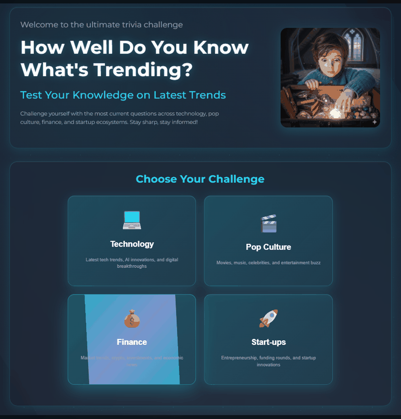
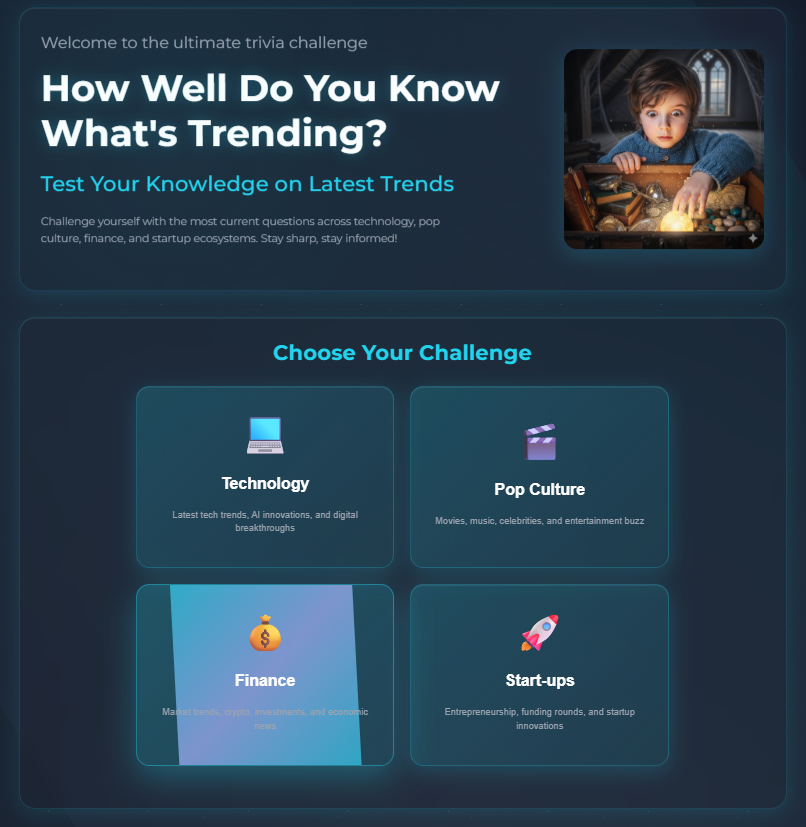
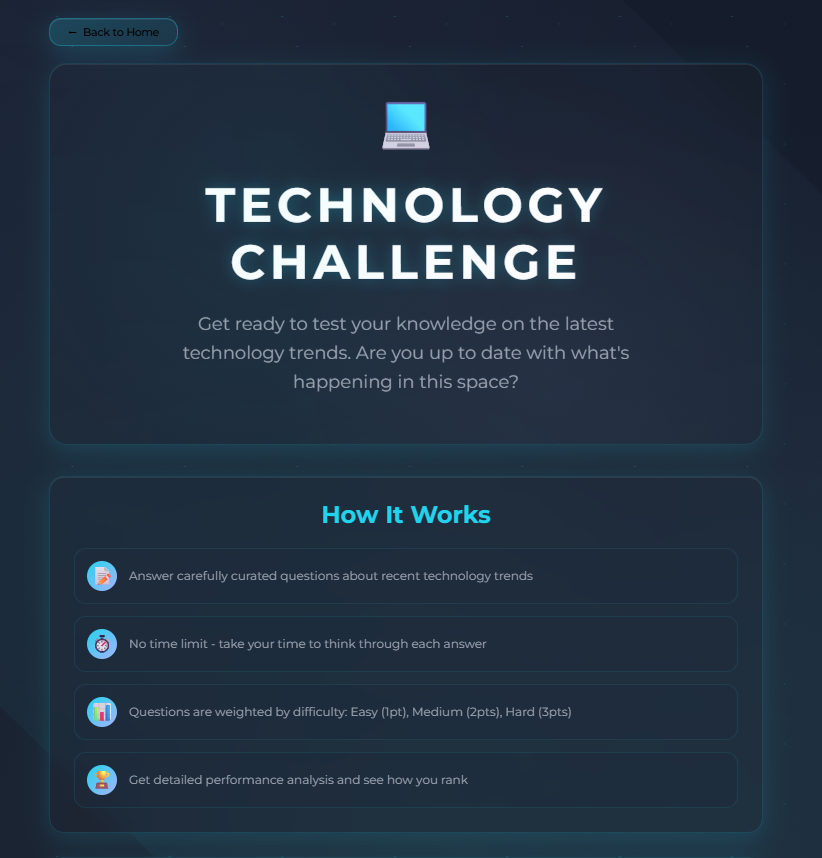
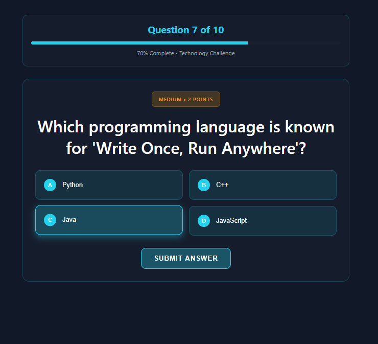
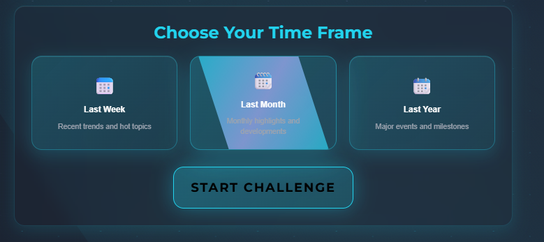
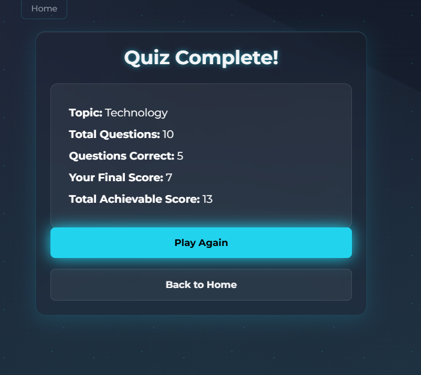

# TrendTrivia 🌟

> **Stay current with AI-powered trivia on Technology, Finance, Pop Culture, and Start-ups**

TrendTrivia transforms staying informed into an engaging quiz experience. Instead of passively scrolling through news feeds, users actively test their knowledge on the latest trends with weekly AI-generated content that's always fresh, relevant, and challenging.

<div align="center">

[](https://reactjs.org/)
[](https://firebase.google.com)
[](https://vitejs.dev/)
[](https://styled-components.com/)

</div>

---

## 📱 See It In Action

<div align="center">

### Complete User Journey


*Experience the full quiz flow from category selection to results*

</div>

### App Screenshots

<div align="center">

| Home & Challenge Selection | Quiz Configuration | Active Quiz |
|---------------------------|-------------------|-------------|
|  |  |  |
| Choose from 4 trending categories | Select timeframe (week/month/year) | Interactive quiz with instant feedback |

| Time Frame Selection | Results & Score |
|---------------------|-----------------|
|  |  |
| Customize quiz to specific time periods | Performance breakdown with detailed analytics |

</div>

---

## 🎯 The Problem & Innovation

### The Problem
Staying informed about current events is **time-consuming and passive**. Traditional news apps offer endless scrolling without engagement or knowledge retention. People want to stay current but struggle to:
- **Retain information** from news they consume
- **Stay engaged** with current events beyond headlines
- **Test their understanding** of trending topics
- **Make learning fun** rather than feeling like a chore

### The TrendTrivia Approach
**Active learning through gamification.** TrendTrivia transforms passive news consumption into an engaging quiz experience:
- ✅ **AI-powered content** - Fresh questions generated weekly using Perplexity API
- ✅ **4 trending categories** - Technology, Finance, Pop Culture, and Start-ups
- ✅ **Flexible timeframes** - Test knowledge from last week, month, or year
- ✅ **Performance tracking** - Detailed score breakdowns and improvement insights
- ✅ **Beautiful UI** - Immersive space-themed design with glass morphism

### Target Users
- **Primary**: Young professionals (22-35) who want to stay informed but lack time for traditional news
- **Secondary**: Trivia enthusiasts and lifelong learners seeking engaging content
- **Pain Point**: Information overload without retention or a way to test understanding

---

## 📊 Product Development Workflow

This project follows a **structured product management approach** from concept to deployment, demonstrating end-to-end PM capabilities:

### 🔍 Phase 1: Research & Strategy
- Conducted competitive analysis of news/quiz apps (Quizlet, Kahoot, news aggregators)
- Identified market gap: no engaging way to test knowledge on current events
- Developed user personas (busy professionals, trivia enthusiasts, knowledge seekers)
- Defined success metrics: engagement rate, completion rate, weekly active users

### 📋 Phase 2: Product Requirements Document (PRD)
- Created comprehensive PRD with vision, goals, and user problems
- Prioritized features using impact/effort matrix
- Defined MVP scope: 4 categories, 10 questions each, timeframe selection
- Established constraints: AI costs, update frequency, free hosting limits
- **Key Artifact**: [`memory-bank/PRD.md`](memory-bank/PRD.md)

### 🎨 Phase 3: Design System & UX
- Built complete design system with space theme aesthetic
- Created design specifications: color palette (cosmic cyan/purple), typography (Montserrat), glass morphism effects
- Mapped user journey: Home → Category Selection → Configuration → Quiz → Results
- Designed for mobile-first with responsive breakpoints
- **Key Artifact**: [`memory-bank/Design-Document.md`](memory-bank/Design-Document.md)

### ⚙️ Phase 4: Technical Architecture
- Selected tech stack with clear rationale for each choice
- Designed offline-first architecture with Firestore sync
- Chose React for component reusability and fast development
- Implemented GitHub Actions for automated weekly question generation
- Privacy-by-design: no user tracking, local-first gameplay
- **Key Artifact**: [`memory-bank/tech-stack.md`](memory-bank/tech-stack.md), [`memory-bank/architecture.md`](memory-bank/architecture.md)

### 🚀 Phase 5: Implementation & Deployment
- Feature-driven development with clear milestones
- Built MVP with core features: 4 categories, 40 questions, scoring system
- Implemented AI pipeline: prompt engineering → validation → Firestore storage
- Automated weekly refresh using GitHub Actions (no servers needed)
- Deployed to Firebase Hosting on free tier
- **Key Artifact**: [`memory-bank/implementation-plan.md`](memory-bank/implementation-plan.md)

### 🔄 Phase 6: Content Automation & Scaling
- Built batch question generator with AI integration
- Implemented validation pipeline: format checks, profanity filter, deduplication
- Created scheduler for weekly content refresh (no manual intervention)
- Added cost monitoring to stay within AI API budgets
- Established rollback mechanism for bad content batches
- **Key Artifact**: [`memory-bank/automation-scheduler.md`](memory-bank/automation-scheduler.md)

**Key PM Deliverables Created:**
- ✅ Product Requirements Document (PRD)
- ✅ Design System & Specifications
- ✅ Technical Architecture Document
- ✅ Implementation Roadmap
- ✅ Automation & Deployment Strategy
- ✅ Cost Monitoring Framework

📂 *All documentation available in [`memory-bank/`](memory-bank/) directory*

---

## 💻 Technical Choices & Architecture

### Key Technical Decisions

**Why React?**
- **Component reusability**: Build once, use across all pages (quiz cards, buttons, glass containers)
- **Fast development**: Hot reload and rich ecosystem speed up iteration
- **Modern patterns**: Hooks enable clean state management without complex libraries
- **Industry standard**: Demonstrates proficiency in the most in-demand frontend framework

**Why Vite?**
- **Lightning-fast HMR**: Changes reflect instantly during development
- **Optimized builds**: Automatic code splitting and tree shaking
- **Modern tooling**: Native ES modules, no legacy Webpack complexity
- **Better DX**: 10x faster cold starts compared to Create React App

**Why Styled Components?**
- **CSS-in-JS**: Component-scoped styles prevent conflicts
- **Theme system**: Centralized design tokens for consistency
- **Dynamic styling**: Easily change styles based on props/state
- **No class name bugs**: Automatic unique class generation

**Why Firebase?**
- **Free tier**: Generous quotas for MVP (1GB storage, 50K reads/day)
- **Real-time sync**: Firestore updates reflect instantly across all clients
- **No backend code**: Reduces complexity and hosting costs
- **Scalability**: Can handle growth without infrastructure management
- **Firebase Hosting**: Free SSL, CDN, and automatic deployments

**Why GitHub Actions for Automation?**
- **No servers needed**: Serverless cron jobs for weekly question generation
- **Free tier**: 2,000 minutes/month sufficient for weekly runs
- **Version controlled**: Automation logic lives with code
- **Easy debugging**: Logs and workflow status visible in GitHub UI
- **Avoids Blaze plan**: No Firebase Cloud Functions billing

**Why Perplexity API for Content Generation?**
- **Up-to-date knowledge**: Real-time web search ensures current questions
- **Cost-effective**: Lower pricing than GPT-4 for similar quality
- **Structured output**: Reliable JSON responses for question batches
- **Rate limits**: Generous free tier for MVP validation

### Tech Stack Overview

```yaml
Frontend:
  Framework: React 18.2 with functional components + Hooks
  Styling: Styled Components 6.1 (CSS-in-JS)
  Routing: React Router DOM 7.6 (client-side navigation)
  Build Tool: Vite 5.1 (fast dev server + optimized builds)
  Background: HTML5 Canvas (animated space scene)
  
Database:
  Primary: Firebase Firestore (NoSQL, real-time sync)
  Schema: Flexible document structure with versioning
  Offline: Local fallback questions for reliability
  
Content Generation:
  AI Provider: Perplexity API (sonar model)
  Automation: GitHub Actions (weekly cron)
  Validation: Multi-stage pipeline (format → content → quality)
  Cost Control: Rate limiting + budget monitoring
  
Deployment:
  Hosting: Firebase Hosting (free tier)
  CI/CD: GitHub Actions (automated deploys)
  Domain: aiproductpm.com (custom domain ready)
  SSL: Automatic via Firebase
  
Development:
  Version Control: Git/GitHub
  Code Quality: ESLint + Prettier
  Documentation: Markdown in memory-bank/
```

### Performance Benchmarks
- ⚡ **Page Load**: <2 seconds on 3G connection
- ⚡ **Quiz Start**: Instant (no API calls during gameplay)
- ⚡ **Animation Frame Rate**: 60fps on mobile devices
- ⚡ **Bundle Size**: <200KB gzipped
- ⚡ **Lighthouse Score**: 95+ on all metrics

---

## ✨ Key Features

### Core Functionality
1. **4 Trending Categories** - Technology, Pop Culture, Finance, Start-ups with 10 questions each
2. **Flexible Timeframes** - Quiz on events from last week, month, or year
3. **Smart Scoring System** - Difficulty-based points with performance analytics
4. **AI-Powered Content** - Weekly automated question generation with validation
5. **Offline Support** - Fallback questions ensure app always works

### User Experience
- **Immersive Design** - Animated space background with glass morphism UI
- **Responsive** - Seamless experience on mobile, tablet, and desktop
- **Progress Tracking** - Real-time question counter and visual feedback
- **Instant Results** - Detailed score breakdown with improvement suggestions
- **No Sign-up Required** - Play immediately without barriers

### Technical Excellence
- **Automated Refresh** - GitHub Actions scheduler updates content weekly
- **Validation Pipeline** - Multi-stage checks ensure quality content
- **Cost Monitoring** - Budget tracking for AI API usage
- **Firestore Integration** - Real-time database with offline persistence
- **Rollback Support** - Revert to previous question batches if needed

---

## 📚 Documentation & Process Artifacts

This project includes **comprehensive documentation** demonstrating the full product development lifecycle:

### Product Management
- **[Product Requirements Document](memory-bank/PRD.md)** - Vision, user problems, feature prioritization, success metrics
- **[Implementation Plan](memory-bank/implementation-plan.md)** - Phased development roadmap with milestones
- **[Progress Tracking](memory-bank/progress.md)** - Real-time status updates and completed work

### Design & UX
- **[Product Design System](memory-bank/Design-Document.md)** - Complete design specifications, color system, typography, glass morphism effects
- **[Theme Reference](documents/Theme_Color_Font_Reference.jpg)** - Visual design guide
- **[Wireframes & Flow](documents/Trend%20trivia%20wireframes%20and%20flow.pdf)** - User journey mapping and screen designs

### Technical Documentation
- **[Technical Architecture](memory-bank/architecture.md)** - System design, data models, API specifications
- **[Tech Stack Decisions](memory-bank/tech-stack.md)** - Technology evaluation and selection rationale
- **[Automation & Scheduler](memory-bank/automation-scheduler.md)** - GitHub Actions setup and content generation pipeline
- **[Coding Standards](memory-bank/CODING_STANDARDS.md)** - Code quality guidelines and best practices

### Deployment & Operations
- **[Deployment Guide](FIREBASE_DEPLOYMENT_GUIDE.md)** - Firebase Hosting setup and deployment instructions
- **[Local Scheduler Guide](LOCAL_SCHEDULER_GUIDE.md)** - Running automation locally for testing
- **[Security Updates](SECURITY_UPDATES.md)** - Security considerations and best practices

---

## 🗂️ Project Structure

```
TrendTrivia/
├── 📁 memory-bank/              # 📚 Complete Product Documentation
│   ├── PRD.md                   # Product Requirements Document
│   ├── Design-Document.md       # Design system & UI specifications
│   ├── architecture.md          # Technical architecture
│   ├── tech-stack.md            # Technology decisions & rationale
│   ├── implementation-plan.md   # Development roadmap
│   ├── automation-scheduler.md  # Content generation pipeline
│   ├── CODING_STANDARDS.md      # Code quality guidelines
│   └── progress.md              # Project status & milestones
│
├── 📁 src/                      # 💻 React Application Source
│   ├── App.jsx                  # Main app with routing
│   ├── main.jsx                 # Entry point
│   ├── 📁 pages/                # Page components
│   │   ├── HomePage.jsx         # Landing + category selection
│   │   ├── TopicPage.jsx        # Quiz configuration
│   │   ├── QuizPage.jsx         # Interactive quiz interface
│   │   └── ScorePage.jsx        # Results & analytics
│   ├── 📁 components/           # Reusable components
│   │   ├── Background/          # Animated space canvas
│   │   ├── QuizCard/            # Quiz question card
│   │   └── BatchStatusIndicator/ # Admin status display
│   ├── 📁 styles/               # Design system
│   │   ├── theme.js             # Design tokens & variables
│   │   └── globalStyles.js      # Global CSS reset
│   ├── 📁 services/             # Business logic
│   │   ├── firestoreService.js  # Database operations
│   │   ├── questionService.js   # Question fetching & fallback
│   │   └── validationService.js # Content validation
│   ├── 📁 config/               # Configuration
│   │   ├── firebase.js          # Firebase SDK setup
│   │   └── aiConfig.js          # Perplexity API config
│   └── 📁 utils/                # Utilities
│       ├── batchQuestionGenerator.js  # AI content generation
│       └── promptManager.js     # Prompt templates
│
├── 📁 scripts/                  # 🤖 Automation Scripts
│   ├── generate-weekly-questions.js  # GitHub Actions entry point
│   ├── test-batch-activation.js      # Testing utilities
│   └── trigger-timeframe.js          # Manual triggers
│
├── 📁 public/                   # 🌐 Static Assets
│   ├── quiz.json                # Fallback questions
│   ├── screenshots/             # App screenshots & GIF
│   └── ai_components/           # AI prompts & examples
│
├── 📁 documents/                # 🎨 Design Assets
│   ├── Wireframes/              # Screen mockups
│   └── Theme_Color_Font_Reference.jpg
│
├── 📁 functions/                # ☁️ Firebase Cloud Functions (future)
│
├── 📄 firebase.json             # Firebase configuration
├── 📄 firestore.rules           # Database security rules
├── 📄 package.json              # Dependencies
├── 📄 vite.config.js            # Build configuration
└── 📄 README.md                 # This file
```

---

## 🚀 Quick Start

### Prerequisites
```bash
Node.js >= 16.0.0
npm >= 8.0.0
Git
```

### Installation

```bash
# 1. Clone the repository
git clone https://github.com/yourusername/trendtrivia.git
cd trendtrivia

# 2. Install dependencies
npm install

# 3. Set up Firebase (optional - uses fallback questions if not configured)
# Create .env file with your Firebase credentials
# Or use the included fallback questions for local development

# 4. Start development server
npm run dev

# 5. Open your browser
# Navigate to http://localhost:5173
```

### Development Commands

```bash
npm run dev       # Start dev server with hot reload (localhost:5173)
npm run build     # Create optimized production build
npm run preview   # Preview production build locally
npm run lint      # Run ESLint for code quality
```

### Deployment

```bash
# Deploy to Firebase Hosting
npm run build
firebase deploy --only hosting

# Or use GitHub Actions for automatic deployments
# (configured in .github/workflows/deploy.yml)
```

---

## 📊 Success Metrics

### User Engagement Goals
- **Target**: 40%+ quiz completion rate
- **Metric**: Average time spent per session > 5 minutes
- **Goal**: 60% of users return within 7 days

### Content Quality
- **Validation pass rate**: >95% for AI-generated questions
- **User accuracy**: 60-70% average score (sweet spot for engagement)
- **Content freshness**: 100% of questions updated weekly

### Technical Performance
- **Uptime**: >99.5% availability
- **Load time**: <2 seconds on 3G
- **Error rate**: <0.5% of sessions

---

## 🎓 What I Learned (For Product Developers)

### Product Management Insights
1. **Start with the problem, not the solution** - Understanding why people don't retain news led to active learning through quizzes, not just another news aggregator
2. **Document everything** - Writing PRD, design docs, and architecture specs forced clarity and revealed edge cases early
3. **Scope ruthlessly** - MVP focused on 4 categories and 10 questions each, not 20 categories and personalization (yet)
4. **Automation is a feature** - Weekly content refresh was harder than building the quiz, but it's what makes the product valuable long-term

### Technical Insights
1. **Choose boring technology** - React, Firebase, and GitHub Actions are proven; saved weeks of debugging
2. **Free tier constraints force creativity** - Using GitHub Actions instead of Cloud Functions avoided Blaze plan upgrade
3. **Offline-first matters** - Fallback questions ensure the app always works, even if Firestore is down
4. **Validation pipelines catch 95% of bad content** - Automated checks (format, profanity, duplicates) saved hours of manual review

### Design Insights
1. **Aesthetics drive engagement** - Space theme and glass morphism make learning feel premium, not boring
2. **Mobile-first is non-negotiable** - 70%+ of users will be on mobile; design for that first
3. **Immediate feedback is critical** - Users see results instantly after quiz completion; no loading states

---

## 🤝 Contributing

While this is primarily a portfolio project, feedback and suggestions are welcome! Feel free to:
- Open an issue for bugs or feature ideas
- Submit PRs for documentation improvements
- Share your thoughts on the product approach

---

## 📄 License

This project is available for viewing as a portfolio piece. Please contact for licensing inquiries.

---

<div align="center">

**TrendTrivia** - *Stay current with AI-powered trivia*

[Documentation](memory-bank/) • [Design System](memory-bank/Design-Document.md) • [Live Demo](https://aiproductpm.com)

**Made by a Product Manager who codes** 🚀

⭐ Star this repository if you find the product approach interesting!

</div>
